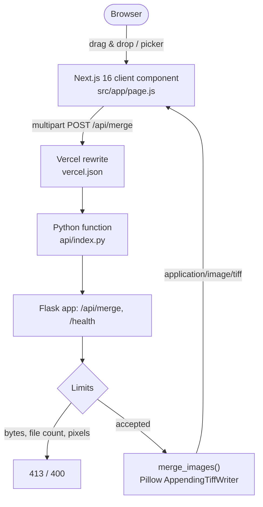

# Merge-TIFF

[](https://github.com/Shreyansh2203/Merge-TIFF/actions/workflows/ci.yml)
[](LICENSE)
[](package.json)
[](package.json)
[](api/index.py)

A web tool that merges multiple TIFF images into a single multi-page TIFF, in the browser. The page never sees your files: the browser uploads them to a serverless function that reassembles them with Pillow and streams one `.tif` back.

---

## Problem

Multi-page TIFFs are what scanners, microform readers, and geospatial tooling actually produce, but the common failure mode is a folder of single-page TIFFs and a viewer that only opens the first one. The usual remedies are a desktop GUI (not available on a locked-down machine), a commercial SDK, or an ImageMagick shell pipeline (not available where there is no shell).

Merge-TIFF does the one thing you need, in a browser tab, with no install and no account.

---

## Architecture



Two tiers, joined by one rewrite:

- **Tier 1 — Next.js 16 (App Router).** Renders the dropzone, owns file selection and client-side error state, and downloads the result as a blob. It is a static page; it holds no image data.
- **Tier 2 — Python function.** `api/index.py` is a Flask WSGI app. It enforces the upload limits, decodes with Pillow, and writes the multi-page TIFF.

The browser calls `/api/merge`, which `vercel.json` routes to the Python function. The rewrite selects the function; it does not rewrite the path the function sees, so Flask still matches on `/api/merge`. See [Deployment](#deployment-on-vercel).

---

## Features

- **Multi-page merge.** One output `.tif` with one page per uploaded file, in the order you added them.
- **Per-page provenance.** Every page carries its source filename in the TIFF `PageName` (270) and `PageDescription` (285) tags.
- **Honest failures.** A rejected file fails the whole request with the offending name. The endpoint never returns a "successful" merge that quietly dropped pages.
- **Upload limits.** Request bytes, file count, and decoded pixel count are all capped, so a single request cannot exhaust function memory.
- **Decompression-bomb defence.** `Image.MAX_IMAGE_PIXELS` is set explicitly and `Image.DecompressionBombError` is handled, so a tiny crafted TIFF cannot expand into gigabytes.
- **No error-detail leaks.** Failures are logged server-side; clients receive a generic message.
- **Accessible UI.** The dropzone is a real `<button>` with a visible focus ring, inline `role="alert"` / `role="status"` messaging, and no `alert()` dialogs.

---

## Requirements

- Node.js >= 20.9 (Next.js 16 minimum)
- Python >= 3.12 (matches the Vercel Python runtime default)

---

## Local Development

The two tiers run as separate processes in development. Run them in two terminals.

### 1. The Python function

```bash
python -m venv .venv
# Windows: .venv\Scripts\activate
# macOS/Linux: source .venv/bin/activate
pip install -r requirements-dev.txt
python api/index.py
```

That serves the API on <http://127.0.0.1:5328>:

```bash
curl http://127.0.0.1:5328/health
# {"max_files":20,"max_image_pixels":50000000,"max_request_bytes":4194304,"status":"ok"}
```

### 2. The Next.js frontend

```bash
npm install
npm run dev
```

That serves the UI on <http://localhost:3000>.

### 3. Point the frontend at the local function

`next dev` serves the app but has no `/api/merge` route of its own, so the browser's `fetch('/api/merge')` will 404 until you add a rewrite. Add this to a local, uncommitted `next.config.mjs` (or commit it if you prefer a proxy in development):

```js
async rewrites() {
  return [{ source: '/api/:path*', destination: 'http://127.0.0.1:5328/api/:path*' }];
}
```

---

## Quality Gates

```bash
npm run lint      # ESLint via eslint-config-next
npm run build     # next build
python -m pytest  # Flask + Pillow merge tests
```

The pytest suite generates its fixtures in `tmp_path` with Pillow, so no binary test assets are committed.

---

## API

### `POST /api/merge`

`multipart/form-data` with one or more parts named `files`.

| Status | Meaning |
|---|---|
| `200` | Merged TIFF returned as `image/tiff`, `Content-Disposition: attachment` |
| `400` | No `files` field, no files selected, non-TIFF extension, unreadable or corrupt TIFF, unsupported page-mode combination, or more than 20 files |
| `413` | Request body exceeds 4 MB |
| `500` | Unexpected server fault (detail logged, never returned) |

All error responses are JSON: `{ "error": "<human-readable reason>" }`.

Example:

```bash
curl -X POST http://127.0.0.1:5328/api/merge \
  -F "files=@page1.tif" \
  -F "files=@page2.tif" \
  -o merged.tif
```

### `GET /health`

```json
{
  "status": "ok",
  "max_request_bytes": 4194304,
  "max_files": 20,
  "max_image_pixels": 50000000
}
```

---

## Limits and Behaviour

| Limit | Value | Rationale |
|---|---|---|
| Request body | 4 MB | Vercel Functions reject payloads over 4.5 MB with `FUNCTION_PAYLOAD_TOO_LARGE` |
| Files per request | 20 | Bounds decode work per invocation |
| Decoded pixels per image | 50,000,000 | `Image.MAX_IMAGE_PIXELS`; error is raised past 2x this |
| Output compression | `tiff_adobe_deflate` | Lossless, and pinned because Pillow applies one `encoderinfo` to every page |

Things worth knowing:

- **The response is capped at 4.5 MB by the platform.** Merging enough pages to exceed that will fail at the edge even though the request was accepted. This is the practical ceiling on a Vercel deployment.
- **Output compression is uniform.** Pillow shares one `encoderinfo` across all pages of a multi-page save, so per-page compression cannot be preserved. Deflate is used for every page.
- **Mixed modes and sizes are supported.** Differing colour modes, bit depths, and page sizes round-trip correctly, because each page is written with its own minimal tag set rather than inheriting the first page's tags. The one unsupported combination is bilevel (`1`) together with palette (`P`/`PA`), which returns `400` with instructions.
- **One page per uploaded file.** A multi-page TIFF that you upload is contributed as a single page; its frames are not expanded.
- **Untrusted input.** Files are decoded in memory and never written to disk.

---

## Deployment on Vercel

1. Import the repository at [vercel.com/new](https://vercel.com/new). Keep the framework preset on **Next.js**.
2. `requirements.txt` is read automatically and Flask, Pillow, and Werkzeug are installed into the Python function.
3. `api/index.py` is treated as a file-based Python function. Vercel serves it at its file path and loads the module-level `app` variable, which is this project's WSGI callable.
4. `vercel.json` routes `/api/(.*)` and `/health` to that function. Vercel rewrites change which function handles a request, not the path the function observes, so Flask's own `/api/merge` and `/health` routes match.
5. The `if __name__ == "__main__"` block in `api/index.py` is dead on Vercel — the module is imported, not run as a script — and exists only for local development.

**Verify once after the first deploy.** Vercel can also detect a Python *framework* preset from `requirements.txt`. If the Flask preset were ever selected it would claim every request and the Next.js site would stop serving. If the deployed site returns Flask's 404 instead of the app, set **Framework Preset → Next.js** in Project Settings and redeploy. See [Open items](#open-items--recommendations).

---

## License

[MIT License](LICENSE).
