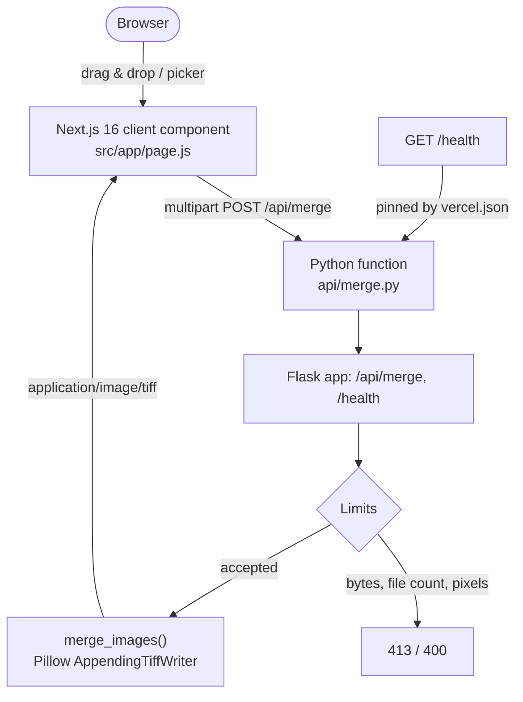

# Merge-TIFF

[](https://github.com/Shreyansh2203/Merge-TIFF/actions/workflows/ci.yml)
[](LICENSE)
[](package.json)
[](package.json)
[](api/merge.py)

A web tool that merges multiple TIFF images into a single multi-page TIFF, in the browser. The page never sees your files: the browser uploads them to a serverless function that reassembles them with Pillow and sends one `.tif` back.

---

## Problem

Multi-page TIFFs are what scanners, microform readers, and geospatial tooling actually produce, but the common failure mode is a folder of single-page TIFFs and a viewer that only opens the first one. The usual remedies are a desktop GUI (not available on a locked-down machine), a commercial SDK, or an ImageMagick shell pipeline (not available where there is no shell).

Merge-TIFF does the one thing you need, in a browser tab, with no install and no account.

---

## Architecture



Two tiers, joined by one URL:

- **Tier 1 — Next.js 16 (App Router).** Renders the dropzone, owns file selection and client-side error state, and downloads the result as a blob. It is a static page; it holds no image data. The download-name sanitisation it uses lives in `src/lib/downloadName.mjs`, outside the component so it can be tested.
- **Tier 2 — Python function.** `api/merge.py` is a Flask WSGI app. It enforces the upload limits, decodes with Pillow, and writes the multi-page TIFF.

The browser posts to `/api/merge`, which is the route Vercel serves the file-based function at, because Vercel serves each file in `api/` at its file path. `vercel.json` pins that destination and maps `/health` onto the same function. See [Deployment](#deployment-on-vercel).

---

## Features

- **Multi-page merge.** One output `.tif` with one page per uploaded file, in the order you added them.
- **Per-page provenance.** Every page carries its source filename in the TIFF `PageName` (270) and `PageDescription` (285) tags.
- **Honest failures.** A rejected file fails the whole request with the offending name, so a merge never reports success after a page failed to decode. The one thing that is dropped without comment is an upload part with a blank filename, which is discarded before the merge starts; a client that sends one gets `200` and fewer pages than it posted.
- **Upload limits.** Request bytes, file count, and decoded pixel count are all capped, so a single request cannot exhaust function memory. The peak is bounded but not trivial: every page is decoded and held in memory at once, and the output response ceiling is checked *after* the merged TIFF has been assembled, so the transient peak is the decoded pages plus two copies of the output. The pixel budget is what keeps that finite — at `50M` pixels it is roughly 200 MB of decoded page data, which is the number to lower if the function runs somewhere with a smaller memory limit.
- **Decompression-bomb defence.** `Image.MAX_IMAGE_PIXELS` is set explicitly and `Image.DecompressionBombError` is handled, so a tiny crafted TIFF cannot expand into gigabytes. On top of that, the page dimensions in the TIFF header are checked against a per-image and a per-request pixel budget *before* the page is decoded, so a file that passes Pillow's own gate is still refused.
- **Unhelpful errors are avoided, not secret ones.** A `4xx` names the offending file and says what was wrong with it, because that is what the uploader needs. That does mean a client learns your internal limits: the pixel budget message quotes the configured number, and the `413` quotes the byte size the merge actually reached. Only the `5xx` path is generic — an unexpected failure is logged with its traceback and the client gets a fixed string, so a bug never becomes a disclosure.
- **Accessible UI.** The dropzone is a real `<button>` with a visible focus ring, inline `role="alert"` / `role="status"` messaging, and no `alert()` dialogs.

---

## Requirements

- Node.js >= 20.9 (Next.js 16 minimum)
- Python >= 3.12 (matches the Vercel Python runtime default)

---

## Local Development

The two tiers run as separate processes in development. Run them in two terminals.

### 1. The Python function

```bash
python -m venv .venv
# Windows: .venv\Scripts\activate
# macOS/Linux: source .venv/bin/activate
pip install -r requirements-dev.txt
python api/merge.py
```

That serves the API on <http://127.0.0.1:5328>:

```bash
curl http://127.0.0.1:5328/health
# {"max_files":20,"max_image_pixels":50000000,"max_request_bytes":4194304,"max_response_bytes":4194304,"max_total_image_pixels":50000000,"status":"ok"}
```

### 2. The Next.js frontend

```bash
npm install
npm run dev
```

That serves the UI on <http://localhost:3000>.

### 3. Point the frontend at the local function

`next dev` serves the app but has no `/api/merge` route of its own, so the browser's `fetch('/api/merge')` will 404 until you add a rewrite. Add this to a local, uncommitted `next.config.mjs` (or commit it if you prefer a proxy in development):

```js
async rewrites() {
  return [{ source: '/api/:path*', destination: 'http://127.0.0.1:5328/api/:path*' }];
}
```

---

## Quality Gates

```bash
npm run lint                        # ESLint via eslint-config-next
npm run test:ui                     # node --test, download-name sanitisation
npm run build                       # next build
python -m pytest                    # Flask + Pillow merge tests
pip-audit -r requirements.txt       # known advisories in the Python dependency tree
npm audit --audit-level=high        # known advisories in the Node dependency tree
```

CI runs lint, the client unit tests, build and pytest on every push to `main` and every pull request, plus three extra gates:

- `pip-audit -r requirements.txt` — fails on any advisory in the Python tree, including transitives such as Jinja2 and MarkupSafe. `pip-audit` is pinned in `requirements-dev.txt`; it is a developer tool and is not installed into the deployed function.
- `npm audit --audit-level=high` — fails on a new high or critical advisory.
- `npm run lint -- --max-warnings=0` — lint *warnings* fail the build, not just errors. Locally `npm run lint` stays permissive; pass `-- --max-warnings=0` yourself to reproduce CI.

Both audits also run on their own schedule: `.github/workflows/security.yml` runs weekly on Monday against the dependency files as they are, so an advisory published against a version that is already pinned fails the build even when nothing in the repository has changed. Run it by hand from the **Actions** tab with **Run workflow** after a bump, before merging it.

The pytest suite generates its fixtures in `tmp_path` with Pillow, so no binary test assets are committed.

---

## API

### `POST /api/merge`

`multipart/form-data` with one or more parts named `files`.

| Status | Meaning |
|---|---|
| `200` | Merged TIFF returned as `image/tiff`, `Content-Disposition: attachment` |
| `400` | No `files` field, no files selected, non-TIFF extension, unreadable or corrupt TIFF, unsupported page-mode combination, or more than 20 files |
| `413` | Request body exceeds 4 MB, or the merged TIFF would exceed the 4 MB response ceiling |
| `500` | Unexpected server fault (detail logged, never returned) |

All error responses are JSON: `{ "error": "<human-readable reason>" }`.

Example:

```bash
curl -X POST http://127.0.0.1:5328/api/merge \
  -F "files=@page1.tif" \
  -F "files=@page2.tif" \
  -o merged.tif
```

### `GET /health`

```json
{
  "status": "ok",
  "max_request_bytes": 4194304,
  "max_response_bytes": 4194304,
  "max_files": 20,
  "max_image_pixels": 50000000,
  "max_total_image_pixels": 50000000
}
```

---

## Limits and Behaviour

| Limit | Value | Rationale |
|---|---|---|
| Request body (this app) | 4 MB | `app.config["MAX_CONTENT_LENGTH"]`; returns `413` with a JSON error |
| Request body (Vercel) | 4.5 MB | Hard platform cap; over it the edge returns `413 FUNCTION_PAYLOAD_TOO_LARGE` |
| Response body (this app) | 4 MB | `MAX_RESPONSE_BYTES`, held under the platform cap so an oversized merge fails here with a reason |
| Response body (Vercel) | 4.5 MB | Same hard cap on the way out; over it the edge returns `413 FUNCTION_PAYLOAD_TOO_LARGE` |
| Files per request (this app) | 20 | Bounds decode work per invocation |
| Decoded pixels per image (this app) | 50,000,000 | Read from the TIFF header before the page is decoded; Pillow's own gate is kept as a backstop |
| Decoded pixels per request (this app) | 50,000,000 | One budget across every page in a request, so 20 small-file uploads cannot decode 20 full-size pages at once |
| Output compression | `tiff_adobe_deflate` | Lossless. Pillow threads one `encoderinfo` across the pages of a single `_save_all`, so the compression is passed on every `image.save()` instead — each page gets a fresh `ImageFileDirectory_v2` rather than sharing one |

Things worth knowing:

- **Vercel caps both directions at 4.5 MB, and this app's own caps sit below that at 4 MB.** The 4 MB application limits are deliberately set under the platform's 4.5 MB so that an oversized request *or* response is refused by this app with a clear JSON message, rather than being cut off at the edge with an opaque platform error.
- **A merge that would return more than 4 MB is refused here, with a `413` that says what to do.** The merged TIFF is assembled in memory and re-encoded, and re-encoding is not guaranteed to shrink: pages that arrive heavily compressed (JPEG-in-TIFF, LZW at a high ratio) can come back out larger than they went in. So the size of the finished body is measured before it is sent, and a merge above `MAX_RESPONSE_BYTES` returns the offending size, the limit, and the two remedies that work: **merge fewer pages per request**, or **split the batch into several smaller merges**. Re-compressing the source files does not help — every page is already written as lossless Deflate. The UI shows this message inline, the same as any other error. Lifting the ceiling altogether is not a config change: the platform's 4.5 MB response limit would still apply, and the way past it is client-direct upload to Vercel Blob.
- **Output compression is uniform across every page.** Every `image.save()` on the shared `AppendingTiffWriter` is passed the same `compression=`, so per-page compression cannot be preserved and every page is written as Adobe Deflate. The uniformity comes from that explicit argument, not from Pillow: `_save_all` reuses one `encoderinfo` across its pages, which is exactly why this code saves pages one at a time with a fresh `tiffinfo` each time rather than using `append_images`.
- **Mixed modes and sizes are supported.** Differing colour modes, bit depths, and page sizes round-trip correctly, because each page is written with its own `ImageFileDirectory_v2` instead of sharing the first page's. That stops one page inheriting the *first* page's tags; it does not make the page minimal, because Pillow still carries a source file's own tags (resolution, software, XMP, custom tags) through to its output page. The one unsupported combination is bilevel (`1`) together with palette (`P`/`PA`), which returns `400` with instructions.
- **One page per uploaded file.** A multi-page TIFF that you upload is contributed as a single page — its frames are not expanded, so a 50-frame scan becomes one page of the output. Upload the frames as separate files to get 50 pages.
- **Untrusted input.** Files are decoded in memory and never written to disk. Every limit above is applied from the upload's own bytes — the request cap while the body is read, and the pixel caps from the TIFF header before any page is decoded — so a page that would be too expensive to decode is refused rather than decoded and then measured.
- **There is no authentication, and none is needed to keep this from being abused.** The endpoint is anonymous and stateless, so the protection that matters is per-request work, which the limits above already bound: at most 4 MB in, 20 pages, 50M decoded pixels, 4 MB out, 30 s. What is *not* bounded is request *frequency*. If you put this behind a domain that attracts traffic, put a rate limiter in front of it — Vercel Firewall / WAF rate-limiting rules on `/api/merge`, or any reverse proxy in front of a self-hosted copy. That is a deployment setting, not application configuration, which is why there is no token or shared secret in this repository.

---

## Deployment on Vercel

`vercel.json` decides how both tiers are built and routed. Nothing below is left to Vercel's framework inference:

```json
{
  "$schema": "https://openapi.vercel.sh/vercel.json",
  "framework": "nextjs",
  "functions": {
    "api/merge.py": {
      "maxDuration": 30,
      "excludeFiles": "{tests/**,.pytest_cache/**,.venv/**,venv/**,**/__pycache__/**,*.pyc}"
    }
  },
  "rewrites": [
    { "source": "/api/:path*", "destination": "/api/merge" },
    { "source": "/health", "destination": "/api/merge" }
  ]
}
```

- **`framework: "nextjs"` pins the Framework Preset** instead of letting Vercel infer one. Vercel infers a Python framework from a matching dependency in `requirements.txt`, and [a Python framework preset takes precedence over file-based functions](https://vercel.com/docs/functions/runtimes/python/api-directory#framework-preset-precedence): the framework app then answers *all* requests, including `/`, and the files under `api/` stop becoming separate Functions. The `Flask` dependency cannot be removed — the function *is* a Flask app — so the preset is pinned rather than inferred.
- **`api/merge.py` is the file-based Python function.** Vercel serves each file in `api/` at its file path, so this one is served at `/api/merge`: the exact URL the browser already calls. The file is deliberately **not** named one of Vercel's framework entrypoints (`app.py`, `index.py`, `server.py`, `main.py`, `wsgi.py`, `asgi.py`), because a Flask `app` at one of those names is the signature the Flask preset searches for. No such file exists at the project root or in `src/`, `app/`, or `api/`, so that signature cannot be completed even if the pin above were removed.
- **`app` is the WSGI callable** Vercel loads from the file. Flask's own routes are `/api/merge` and `/health`.
- **The rewrites select which route handles a request without changing the path the function observes** — Vercel has a separate, explicit `transforms` option for rewrites that *should* change it — so `/health` still matches Flask's `/health` route instead of arriving as `/api/merge`.
- `requirements.txt` is read automatically, and Flask, Pillow, and Werkzeug are installed into the Python function.
- The `if __name__ == "__main__"` block in `api/merge.py` never runs on Vercel — the module is imported as a function handler, not executed as a script — and exists only for local development.

`tests/test_deploy_config.py` asserts all of the above statically, so dropping the preset pin, renaming the function back to an entrypoint name, pointing a rewrite at a function that does not exist, or breaking the WSGI callable fails CI instead of a deployment.

### First deploy: what a repository cannot check

Everything above is enforced by CI, but two things can only be confirmed against a real deployment:

1. **The Framework Preset in the dashboard.** `vercel.json` overrides the preset for each deployment, but the stored project setting is server-side: open <https://vercel.com/dashboard> → **Merge-TIFF** → **Settings** → **Build & Deployment** and confirm **Framework Preset** reads **Next.js**. If it reads `Flask`, select **Next.js** and redeploy — the `vercel.json` pin should already have prevented it, and this check is what proves that it did.
2. **The three smoke tests below**, which confirm the function was built, that it is reachable at `/api/merge`, and that the page being served is the Next.js one.

#### The symptom a wrong preset would still produce

If a Flask preset were ever selected, Flask receives every request including `/`. No Flask route matches `/`, so the browser renders Flask's built-in error page: a bare, unstyled `404 Not Found` on an empty white page — no dropzone, no styles, no page content. The deployment would still report success, and `/health` and `/api/merge` would still respond, because Flask *does* serve those two paths. Check `GET /` first, not just the API.

#### Smoke test

Run all three against the deployed URL. All three must behave as listed.

| Check | Expected |
|---|---|
| `GET /` | `200`, styled page containing the heading `TIFF Merger`. A bare unstyled 404 means the framework preset is wrong. |
| `GET /health` | `200` with `content-type: application/json` and body `{"max_files":20,"max_image_pixels":50000000,"max_request_bytes":4194304,"max_response_bytes":4194304,"max_total_image_pixels":50000000,"status":"ok"}` |
| `POST /api/merge` with two `.tif` parts | `200` with `content-type: image/tiff` and `content-disposition` naming `merged_output.tif`; the body opens as a 2-page TIFF |

```bash
curl -sS -o /dev/null -w '%{http_code} %{content_type}\n' https://<your-domain>/
curl -sS https://<your-domain>/health
curl -sS -X POST https://<your-domain>/api/merge \
  -F "files=@page1.tif" \
  -F "files=@page2.tif" \
  -o merged.tif
```

---

## Open items and recommendations

- **The framework preset is pinned in `vercel.json` and guarded by tests**, so the failure mode that would take the whole site down is now closed in the repository. The dashboard check and the smoke test still need a human once per new Vercel project, as described in [First deploy](#first-deploy-what-a-repository-cannot-check).
- **There is no authentication or rate limiting on `/api/merge`.** It is intentionally public and unauthenticated: adding auth would require a committed secret or edge-level work that was left out of scope. The resource bounds (4 MB in, 4 MB out, 20 files, 50M decoded pixels, 30 s) bound per-request cost; request *rate* is bounded only by whatever you put in front of the deployment.
- **A merge whose output would exceed 4 MB is refused by this app, not the platform.** See [Limits and Behaviour](#limits-and-behaviour): the request is rejected with a `413` that names the size and the limit. The platform's own 4.5 MB response cap is still the hard ceiling; the only way past it is client-direct upload to Vercel Blob, which is a redesign rather than a config change.
- **Both dependency ecosystems are audited.** `pip-audit` and `npm audit` gate every push and pull request, and again on a weekly schedule — see [Quality Gates](#quality-gates). Dependabot watches all three ecosystems (`github-actions`, `npm`, `pip`) weekly.

---

## Portfolio

Other projects by the same author, each solving a different problem:

- **[oracle-bip-reconciler](https://github.com/Shreyansh2203/oracle-bip-reconciler)** — a FastAPI service that matches an OCR'd remittance advice against invoice and receipt history in Oracle Fusion ERP Cloud BI Publisher, repairing the incoming JSON or marking it `UNMATCHED`.
- **[OTL-Voice](https://github.com/Shreyansh2203/OTL-Voice)** — a phone-first web app that turns speech into a structured Oracle Fusion Cloud Time and Labour timecard proposal, using OCI Generative AI and Speech.
- **[Product-Comparison-Advisor-AI-Agent](https://github.com/Shreyansh2203/Product-Comparison-Advisor---AI-Agent)** — an Oracle Fusion Cloud AI Agent that compares two or more Items across 62 product and manufacturing attributes and returns a self-contained HTML comparison table.
- **[Scraping-Bot](https://github.com/Shreyansh2203/Scraping-Bot)** — a Telegram bot that downloads the media behind an Instagram or Twitter/X link.

---

## Contributing

See [CONTRIBUTING.md](CONTRIBUTING.md) for the two-part local setup, the checks CI runs, and the commit convention.

---

## License

[MIT License](LICENSE).
